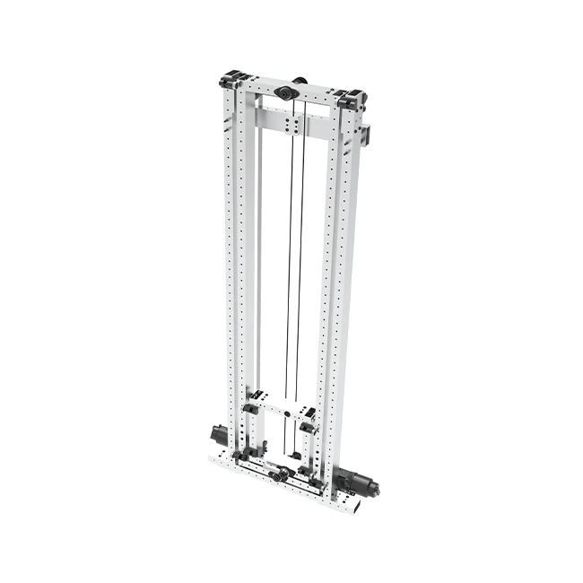
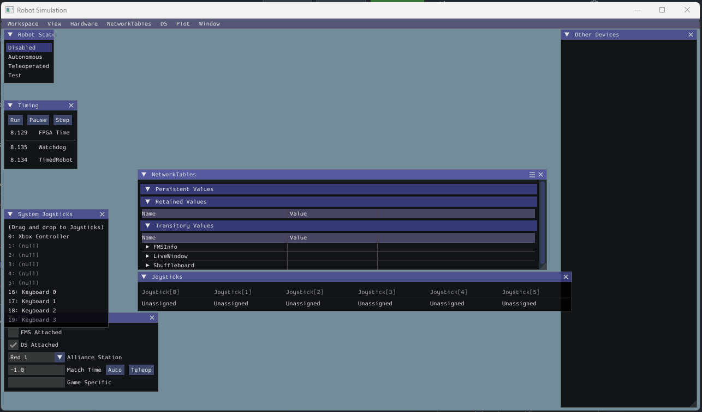

# Simulated Elevator Lab
*By: Drew Williams*

## Introduction
In this lab we will go from a blank project, to a fully functional simulated elevator mechanism.

You will learn about git, wpilib, the command based framework, and simulation. Let's get started!

If you don't know what I mean by "elevator", I just mean a robot mechanism that moves in one direction (usually up and down). Below is an example elevator: 

[Video Example](https://www.youtube.com/watch?v=7xnMQipac2c)

## Notes:
- When giving instructions on what to type into a terminal window, I will use square brackets like this [USERNAME] to signify you need to use your own information for that step.

## Making a copy of this code

First we should make a copy of this repository to your account. We can do this through what are called git forks. A "fork" is like a git branch, but on a different account completely.

1. Go to this repositories home page and click "fork" at the top of the page. Make sure you are the owner and make sure to uncheck "copy the main branch only". 

2. Once that is done, we can download your version of the code using git clone. 

3. Open git bash then run the below commands
    1. `cd dev`
    2. `git clone git@github.com:[USERNAME]/ElevatorLab.git`
    3. Open 2024 WPILib VSCode
    4. Click File > Open Folder, then select the ElevatorLab folder.

4. Building and running the code
    1. Type Ctrl+Shift+P and type "Simulate Robot Code" and click enter. This will build the robot code to run on your computer.
    2. After its done building, a checkbox will appear at the top of VSCode. Make sure Sim Gui is checked and Use Real Driverstation is unchecked, then click the green check.
    3. Soon, a window will appear. This is the robot simulation.

## Exploring the simulator

On the simulator screen you will see a bunch of sub windows you can move around. The main ones to pay attention to are the "Robot State" one and the NetworkTables window. The Robot State one allows you to enable and disable the robot, as well as change it from Autonomous to Teleoperated mode.

Feel free to resize the sub windows to be able to see everything and make it look organized.

## Network tables

The NetworkTables screen shows the contents of the NetworkTables. You can think of the NetworkTables as a big list of keys and values. 

For example, you could have a key called "Elevator Height" and its value could be set by the robot program to the current elevator position. You can also nest entries and they will appear almost like folders in the window. For example, setting the key "Drivetrain/State/Speed X" to 5 would show up as a series of nested entries where the slash denotes the "folders".

The advantage of using NetworkTables for displaying information about the robot is that it allows you to view a lot of things at once without looking at the console if you were using cout or print(). Also, writing to the console is actually a "slow" operation and if you print a lot of things every iteration of the robot loop, it can actually slow down the code.

You can also save all network tables entries after the robot program is done. This is automatically done in the code already. After you close the simulator, a wpilog file will be created. We will look at these files later.
