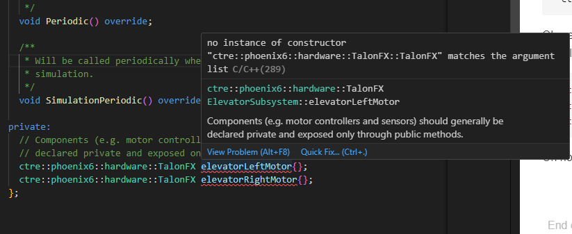

# Implementing our ElevatorSubsystem

First thing we want to do is import the library to control the motor controllers we want to use. Since we are going to use [Falcon500's](https://www.vexrobotics.com/pro/falcon-500), we need to use the Phoenix library. 


## To add this library to our project:
1. Ctrl+Shift+P and search for "Manage Vendor Libraries" and click enter.
2. Then arrow down until you get to "Install new libraries (online)" and click enter.
3. Paste this url into the text box `https://maven.ctr-electronics.com/release/com/ctre/phoenix6/latest/Phoenix6-frc2024-beta-latest.json` and click enter
4. This will place a file into the vendordeps folder that defines where to download the 3rd party libraries.

## Subsystem Basics

As discussed in the previous chapter, each subsystem represets a part of our robot, like an elevator. So that subsystem class should contain information on how to interact with the motors associated with that subsystem. Lets add it!

Open up `ElevatorSubsystem.h`. Since we are using TalonFX motors lets declare an instance of a TalonFX object as a class member. 

In C++, there are different sections for private class members vs public. Lets add our motor to the private section. This will make sure users of our subsystem class can't change things about the motor we dont want them to.

```cpp
private:
  // Components (e.g. motor controllers and sensors) should generally be
  // declared private and exposed only through public methods.
  ctre::phoenix6::hardware::TalonFX elevatorLeftMotor{};
  ctre::phoenix6::hardware::TalonFX elevatorRightMotor{};
```

(We are going to add two motors in this lab as usually elevators need two motors for the power requirements.)

Ok we added that, but you probably see red squiggles. You need to make sure the compiler can find that class, but we haven't included anything so lets add that to the top of the file near the others.

```cpp
#include <frc2/command/CommandPtr.h>
#include <frc2/command/SubsystemBase.h>
#include <ctre/phoenix6/TalonFX.hpp>
```

Oh no! More squiggles. If you hover over the squiggle it should give us more detail.



This error is saying it can't find a version of the TalonFX constructor that has the same arguments we passed in, which is none. We actually need to pass in the CAN id for the motor. Lets add those variables to the constants file for organization purposes. 

```cpp
namespace ElevatorConstants
{
    static constexpr int leftMotorCANId{2};
    static constexpr int rightMotorCANId{3};
}
```

Now lets `#include "Constants.h"` to the `ElevatorSubsystem.h` file so we can see the variables.

And then add those variables to the constructor arguments

```cpp
  ctre::phoenix6::hardware::TalonFX elevatorLeftMotor{ElevatorConstants::leftMotorCANId};
  ctre::phoenix6::hardware::TalonFX elevatorRightMotor{ElevatorConstants::rightMotorCANId};
```

If you try to build the robot code, it should compile successfully. Nice!

Lets move on to part two: [CLICK ME](subsystem2.md)